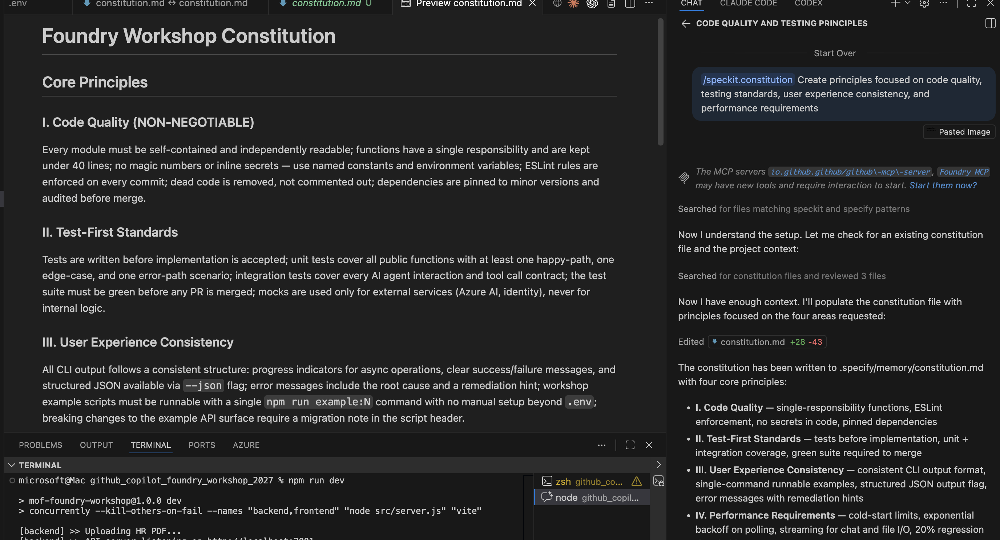
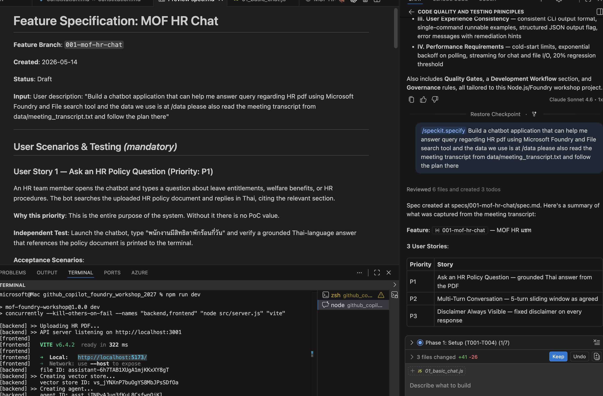
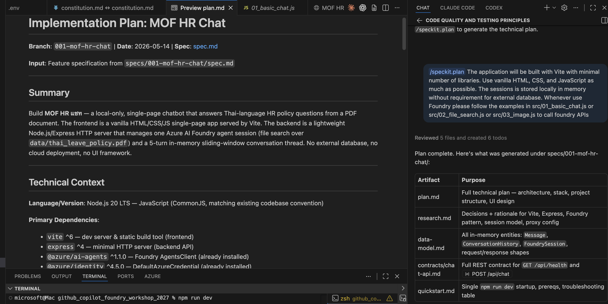
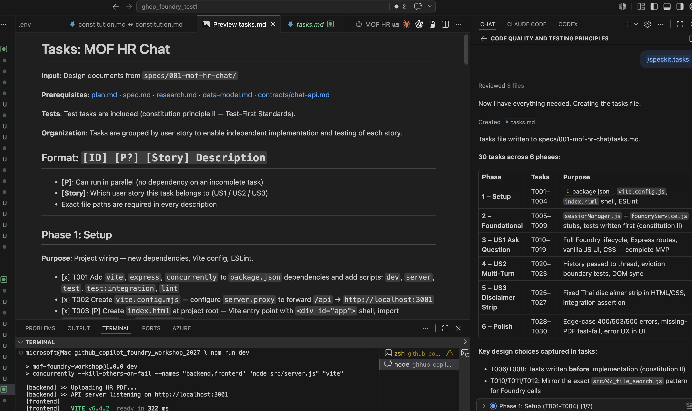
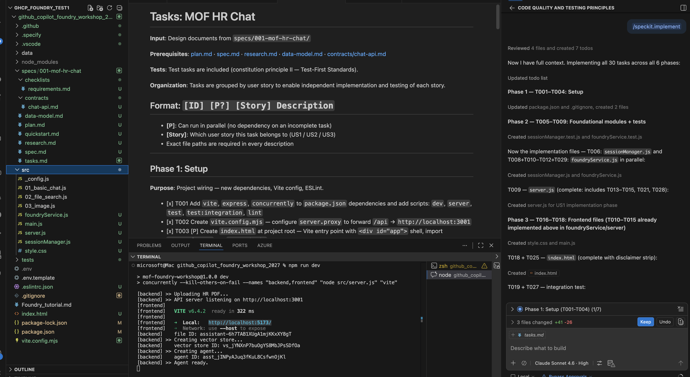
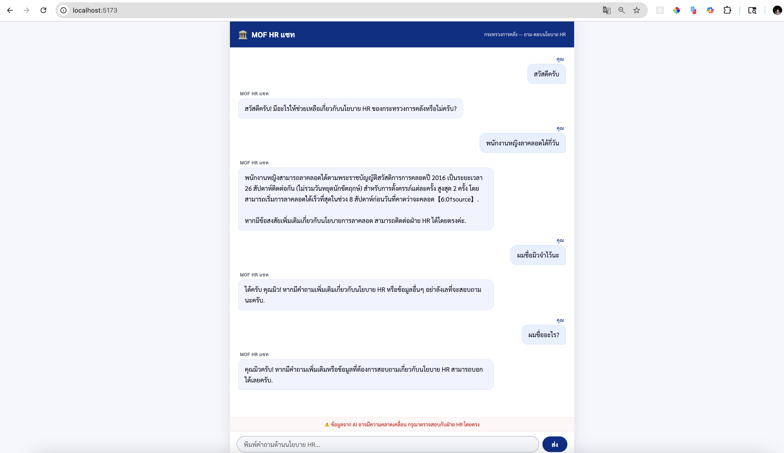
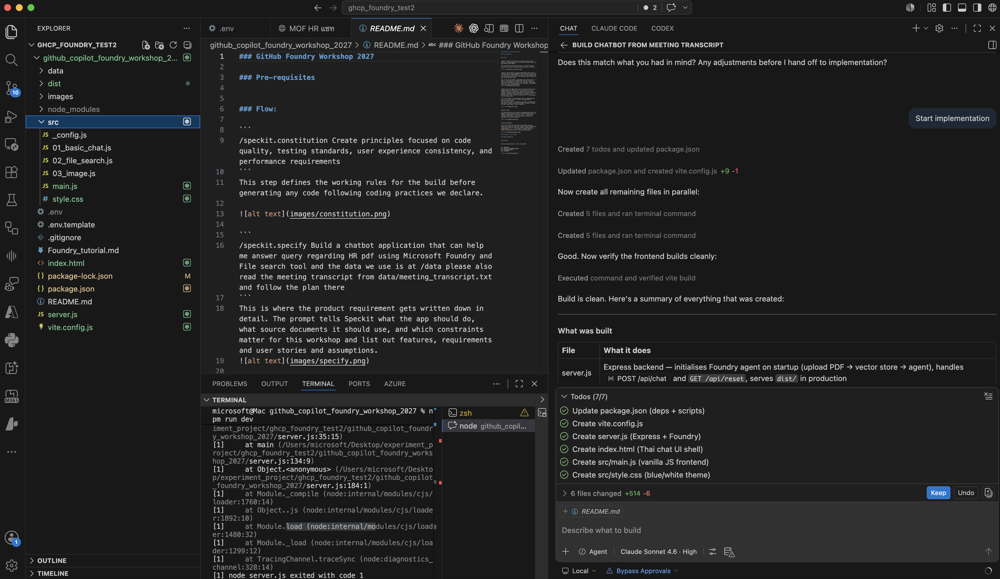
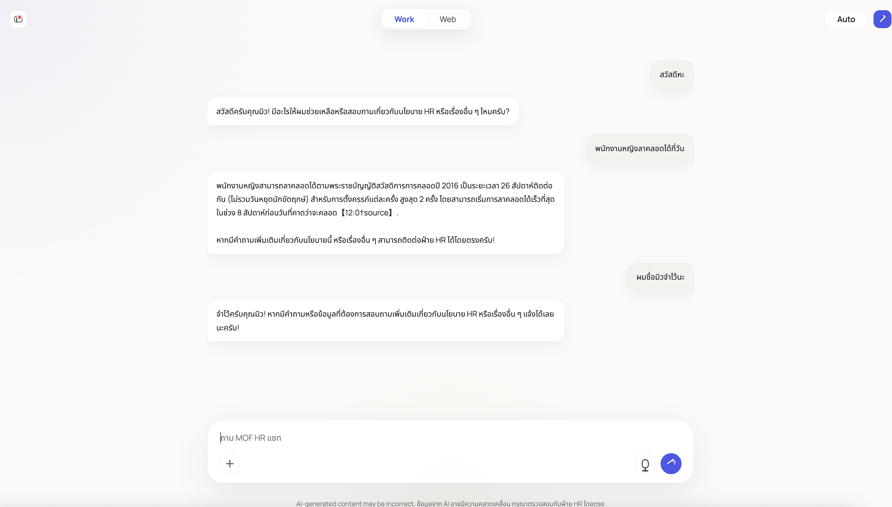

### GitHub Foundry Workshop 2027

### Pre-requisites

Please ensure you have installed node.js at https://nodejs.org/en/download

Then check if the following runs sucessfully
```
npm -v 
node -v
```

Next duplicate `.env.template` file and rename it to `.env` please fill the environmental variable provided by the instructor.

Pre-requisites for spec-kit:

Please install uv: 
http://github.com/github/spec-kit/blob/main/docs/install/uv.md

Afterwards install the speckit CLI
```
uv tool install specify-cli --from git+https://github.com/github/spec-kit.git@v0.8.10
```
Please clone or download the repo. (See here for Git installation https://git-scm.com/book/en/v2/Getting-Started-Installing-Git):
```
git clone https://github.com/edsml-kl121/github_copilot_foundry_workshop_2027.git
```

```
cd github_copilot_foundry_workshop_2027
```
Then,
```
specify init . --integration copilot
```

### Option 1 Spec-driven Development:

```
/speckit.constitution Create principles focused on code quality, testing standards, user experience consistency, and performance requirements
```
This step defines the working rules for the build before generating any code following coding practices we declare.



```
/speckit.specify Build a chatbot application that can help me answer query regarding HR pdf using Microsoft Foundry and File search tool and the data we use is at /data please also read the meeting transcript from data/meeting_transcript.txt and follow the plan there
```
This is where the product requirement gets written down in detail. The prompt tells Speckit what the app should do, what source documents it should use, and which constraints matter for this workshop and list out features, requirements and user stories and assumptions.


```
/speckit.plan The application will be built with Vite with minimal number of libraries. Use vanilla HTML, CSS, and JavaScript as much as possible. The sessions is stored locally in memory without requirement for external database. Whenever use Foundry please follow the examples in src/01_basic_chat.js or src/02_file_search.js or src/03_image.js to call foundry APIs
```
This step converts the requirement into an implementation plan. In practical terms, it tells the agent how to structure the project
The Vite plus vanilla JS guidance also keeps the generated app easy to inspect during the workshop, instead of hiding the main logic behind a large framework.



```
/speckit.tasks
```
This breaks the plan into concrete implementation tasks, for example setting up the frontend, wiring the backend call to Foundry, ingesting the files from `data/`, storing chat session state locally, and validating that answers are grounded in the source material.



```
/specikit.implement
```
This is the execution step where the planned tasks get turned into code. At that point, Speckit should generate the actual app structure, reuse the Foundry calling patterns demonstrated in `src/`, and produce a chatbot that can answer HR questions based on the workshop documents.



### Chatting to the chatbot

To start the app try:

```
npm run dev
```

Here are some questions to test the chatbot

```
Q1) สวัสดีครับ
Q2) พนักงานหญิงลาคลอดได้กี่วัน
Q3) ผมชื่อมิวจำไว้นะ
Q4) ผมชื่ออะไร
```



### Option 2 Plan and Agent mode:

Switch your agent to Plan mode. Type the following with `claude-sonnet-4.6`
```
Please read the meeting transcript at data/meeting_transcript.txt first — it has all the decisions we made about what to build. Then build the chatbot based on that.

The app uses Azure AI Foundry with File Search tool, source files are in /data. Build it with Vite but keep it vanilla HTML, CSS, and JavaScript as much as possible, minimal libraries. Chat history should just live in memory, no database needed.

For any Foundry API calls, follow the examples already in src/01_basic_chat.js, src/02_file_search.js, and src/03_image.js — don't invent your own patterns.
```
Once done press `start implementation`



### Chatting to the chatbot

To start the app try:

```
npm run dev
```

Here are some questions to test the chatbot

```
Q1) สวัสดีครับ
Q2) พนักงานหญิงลาคลอดได้กี่วัน
Q3) ผมชื่อมิวจำไว้นะ
Q4) ผมชื่ออะไร
```


Select agent mode and type the following

```
Generate system design document and use mermaid to generate markdown file called documentation.md
```
(If you haven't already please install the `Markdown Preview Mermaid support` extension from VS code)

switch to GPT-5.4 and agent mode. Type the following prompt
```
Please redesign UI to look like <path_to_image>
```
Look at how our UI design look just like the image we chose:
